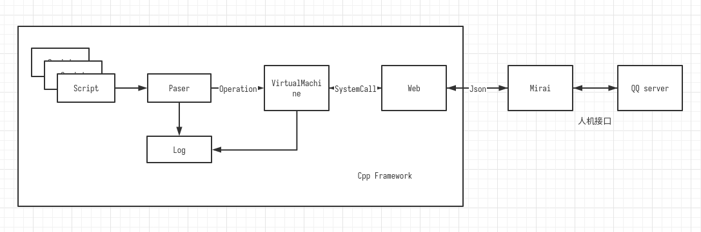
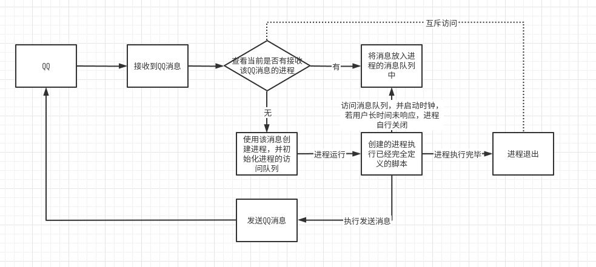

# **一种领域特定脚本语言的解释器的设计与实现**

# 

## 内容

> 领域特定语言（Domain Specific Language，DSL）可以提供一种相对简单的文法，用于特定领域的业务流程定制。本作业要求定义一个领域特定脚本语言，这个语言能够描述在线客服机器人（机器人客服是目前提升客服效率的重要技术，在银行、通信和商务等领域的复杂信息系统中有广泛的应用）的自动应答逻辑，并设计实现一个解释器解释执行这个脚本，可以根据用户的不同输入，根据脚本的逻辑设计给出相应的应答。 

​	本项目使用 ` C++ 17 `  语言实现一个在线客服机器人服务器，并且使用Python QQ机器人框架实现，使用户可以通过QQ与客服机器人进行人机交互。


## 项目管理

​	本项目使用 `cmake 3.21` 进行管理，使用到的第三方库分别有 `jsonxx` ， `boost.asio` , `Boost` .

​	单元测试使用 [google test](https://github.com/google/googletest/) 搭配 `cmake `目录进行管理 

​	Code Style 可参考 C++ Google Code Style 和 [C++ Core Guidelines](https://github.com/isocpp/CppCoreGuidelines). 	

​	在 `cmake` 中，可以通过 `add_subdirectory` 添加子项目目录， 此时 `cmake` 会同时链接子项目目录下的 `CMakeLists.txt`文件，从而实现树形的管理方法.

​	

## DSL 定义 与  `VituralMachine` 操作定义

​	假设你是一个用户小明，你从U公司购买了一批T病毒，之后你想向U公司询问一些使用事项，在使用T病毒后，发现病毒已经失活，无法进行生物实验，你可能还需要向U公司发起一些退款申请。

​	这些申请我们可以总结为工单，客户在遇到一些在机器人处无法解决的问题时，需要发起工单，工单会保存在数据库，等待人工客户进行处理

​	使用事项可以总结为，当客服机器人接收到一些请求时，需要做出响应的回复.

​	最后客服机器人在开启和结束时，需要特殊定义一些类似于问候语和结束语的回复

​	并且可以确定的是，大部分客服机器人都具有分支功能，因为要提供状态机的功能

所以在本项目设计的关键字及语法功能有

```shell

echo {expression}/{id} 回复消息
set {id} [= string] 设置变量名及变量值
input {id} [wait {number}] 等待用户输入消息，并将消息内容储存在变量中
assign {id} = {string} 修改变量的值
call {id} = {string} {proc_id} 调用过程proc_id
break 结束执行
```

使用这套`DSL` 实现U公司的需求可以使用以下脚本

```shell
proc main:
	echo "你好"
	set function
	
	input function wait 5
	call function = "退款" refund
	call function = "工单" order
	
	echo "再见"
	
proc refund:
	
	
proc order:
```

## 顶层设计

本项目设计的模块如下



### Parser 

Parser的功能为解释设计的DSL语言，生成可执行代码，符号表。


### VirtualMachine

​	虚拟机的功能类似于 `JVM` 虚拟机，运行`Paser` 解释的结果，并保存`Paser`中的符号表，同时具有`pc`寄存器，用于保存目前运行的结果，并且具有多用户支持的功能


### Web 

​	实现了请求与响应`Mirai`服务器的功能。使用 `boost.asio` 库实现，同时使用 `jsonxx` 库进行 `json` 的逆序列化。


### Log

​	日志功能，该模块主要在 `CLI` 环境下交互，以及产生日志文件

​	日志信息包括：`Paser` 的编译错误信息， `VirtualMachine` 的日志信息，使用了 `Boost` 的`log`组件实现.


### 外部Web框架

​	该模块使用了 `Mirai` 框架提供的 Web 服务器， 该 Web 服务器实现了使用设备配置文件登陆 QQ ，在 OICQ 协议下工作，可以向监听服务器的地址发送 `Json` 消息


## 详细设计

### Parser

​	根据之前设计的Notation，接下来要利用已有的Compiler Principle的知识，设计解释器。首先是Token的设计，我们可以将 Token 分为`string` ，`identifier`, `reserved_token`。

#### Reserved_token

​	`reserved_token` 表示Parser保留的关键字，可以通过在 `lookup_table` 中查询得到

​	`lookup_table` 的类型是 `map<string, reserved_token>` ，在


### Web设计与多线程实践

首先将QQ与主线程的访问关系梳理出来

 

可以看出，主线程负责执行的任务包括:

- 监听 QQ 发来的消息
- 管理发送消息到线程的消息队列
- 检查线程的状态，创建线程

子线程的任务有：

- 执行用户自定义的脚本
- 访问消息队列
- 发送QQ消息

其中不难发现

检查线程状态与线程退出，访问消息队列是互斥的，为了避免竞争，需要加锁

#### Modern C++ Mutex

为了实现线程间的同步与通信，我们需要使用 C++ 提供的 `std::mutex` 。

并以此来实现一个thread-safe的消息队列

